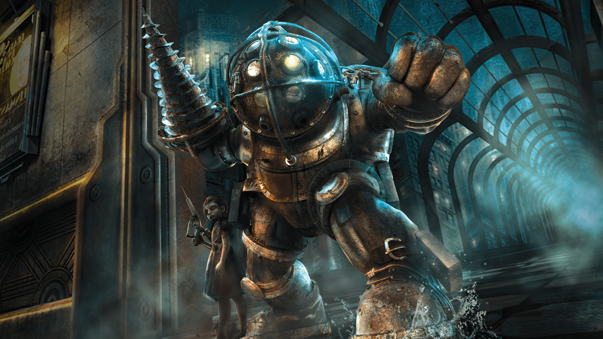

# BioShock : La historia submarina

*BioShock* no es solo un videojuego; es una experiencia que redefine lo que un título de acción en primera persona puede ofrecer. Lanzado en 2007 y desarrollado por **Irrational Games**, este clásico atemporal combina un diseño inmersivo con una narrativa profunda y provocadora.

## Bienvenido a Rapture  

La historia te lleva a **Rapture**, una ciudad submarina creada como un refugio para los mejores y más brillantes de la humanidad. Sin embargo, el sueño utópico se convirtió en una pesadilla cuando la ambición y los avances genéticos descontrolados llevaron al colapso de la sociedad. Como jugador, llegas a Rapture tras un accidente aéreo y descubres un mundo lleno de secretos, horrores y decisiones morales.

## Jugabilidad que Invita a la Exploración  

*BioShock* destaca por su combinación única de acción en primera persona y elementos de rol. Podrás usar armas tradicionales junto con los **plásmidos**, habilidades genéticas que te permiten manipular el entorno y enfrentarte a tus enemigos de formas creativas. ¿Congelar a un enemigo antes de partirlo con una llave inglesa? Totalmente posible.

El diseño del juego fomenta la exploración, recompensándote con fragmentos de historia, recursos y mejoras que amplían tus posibilidades de supervivencia.  

## "¿Acaso un hombre no tiene derecho a elegir?"  

Una de las frases más icónicas de *BioShock* resume su temática central: el conflicto entre libre albedrío y control. Inspirado por la filosofía objetivista de **Ayn Rand**, el juego cuestiona tus elecciones y te enfrenta a dilemas éticos, como el destino de las **Little Sisters**. ¿Serás altruista o egoísta en un mundo donde cada decisión importa?

## Un Legado Inmortal  

*BioShock* recibió aclamación universal por su narrativa, diseño de niveles y estilo artístico. Su influencia ha trascendido los videojuegos, inspirando debates académicos y generando una secuela igualmente memorable: *BioShock Infinite*. A día de hoy, sigue siendo un referente en cómo contar historias profundas a través de la interactividad.

---